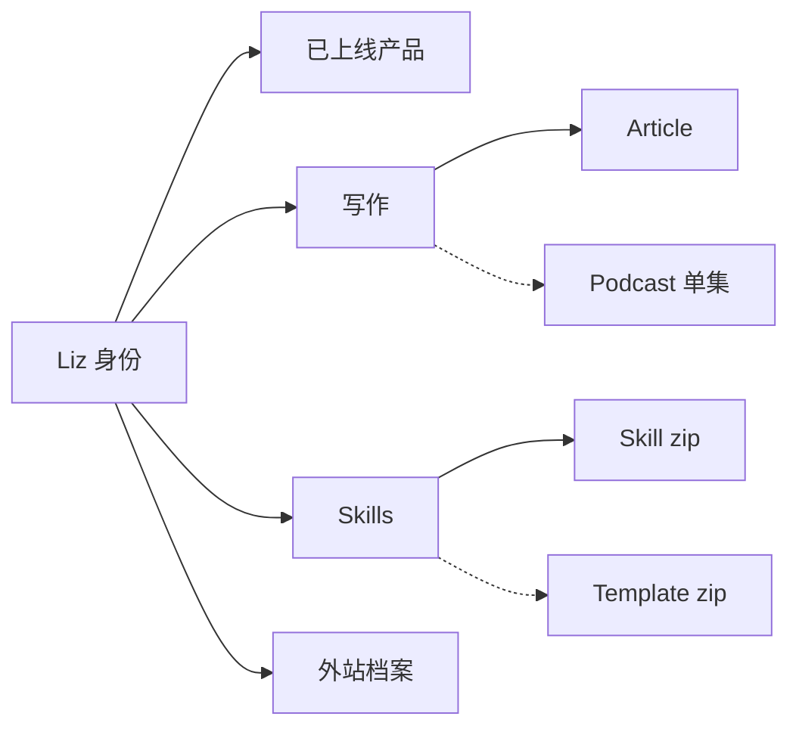

# lizliz.xyz · IA 与用户旅程（v1 · 当前）

> 真源。改导航 / 页面归属 / 水平菜单之前先改本文，再动代码。
> 历史只读：[`audit-2026-08-16-homepage-ia.md`](./audit-2026-08-16-homepage-ia.md)（当时首页还在零售 writing / skills / connect）。
> 本文件**不**冻进 `docs/prd/`：个人站没有拍板仪式；下一版整份替换本文即可。
> 合同来源：`design-templates/templates/ia-user-journey.md`（2026-08-17）。用它的**闸和顺序**，不用它的 OA 名词。

## 1. 产品一句

给路过的人、想读的人、想用她做的东西的人一条公开身份路径：

**认出 Liz → 看她做成的产品 → 去读 / 去下载 / 去联系**

不是内部工具，不是作品集博物馆，不是把 Writing / Skills / Connect 再零售一遍的首页。

不许抢主链点击：Templates、播客单集、AdventureX、简历彩蛋、主题/语言开关、站内搜索、预算讲义加密 slug（幻灯 + 套站模板的阅读页，不是 Writing 门）。

一句话身份（站点声音，见 SOUL / 有趣有用，不装）：

> I write, and I make things that are interesting and useful.  
> 写东西，做有趣有用的小产品。

这是主语，不是功能清单。

## 2. 对象模型（OOUX 薄表）

| 对象 | 一句话 | 关键状态 | 主要关系 | 谁最常碰 |
|---|---|---|---|---|
| **Liz（人）** | 这个站的主语 | Now 会改；站还在 | 产出下面所有对象 | 所有访客第一眼 |
| **Project（已上线站）** | 她做成并挂在网上的东西 | shipped | 属于 Liz；`kind=site` | 想看作品的人 |
| **Article** | 一篇可引用的文章 | published / draft | 属于 Writing 门；URL `/articles/<slug>` | 想读的人 |
| **Skill pack** | 给 agent 用的可下载说明书 | published zip | 属于 Skills 门 | 想拿来用的人 |
| **Template pack** | 设计模板 zip | published zip | Skills 的近亲，**不是第二扇门** | 从 Skills 走进来 |
| **Podcast episode** | 一集音频 | published | Writing 近亲；**无索引页** | 深链 / RSS / 文章互链 |
| **Profile** | GitHub / X / 即刻 | 外站 | 只从 Connect 溢出出去 | 想联系的人 |



首页不生产新对象。它只回答访客三问：这是谁 / 她做成了什么 / 下一步去哪。

多租户：不适用。没有 Organization / Workspace。

对象边界（写进本版，未写入禁止改导航）：

- Project ≠ Skill ≠ Template。首页河只装 `kind=site`。Skill / Template 不得再嵌回首页。
- Article 的分类（心理 / 技术 / 社会 / 商业）是**筛，不是门**。
- Podcast 不是主链叶子。没有 `/podcast` 索引，禁止为了「完整」去造一个。
- AdventureX 是一次性静态页，不是产品对象。
- 简历 PDF 是彩蛋，不是 About 页。

## 3. 谁 × 任务 / 决策（用户语言，禁止库表名）

| 角色 | 今天的活或决策（3 步以内） | 信号 → 行动 | 从哪进 | 不进哪 |
|---|---|---|---|---|
| 路过的人 | 1. 这是谁 2. 值不值得再点 3. 走或留下 | 名字 + 一句 + Now → 留下就点 Projects | `/` 第一屏 | 文章正文、skill 说明书、热力图 |
| 想看作品 | 1. 她做了哪些站 2. 点进一个 | 顶栏 Projects 或首页河 → 外站 | `/#projects` | `/projects` 博物馆（不存在，不准开） |
| 想读 | 1. 进写作门 2. 扫标题 3. 点一篇 | 顶栏 Writing → `/articles/` | Writing | 首页文章预告（禁止加回） |
| 想用 skill | 1. 进 Skills 2. 展开 3. 下载 zip | 顶栏 Skills → `/skills/` | Skills | 首页 skill 河（禁止加回） |
| 想拿模板 | 1. 先到 Skills 2. 看见隔壁一句 3. `/templates/` | Skills 页内链 → 模板页 | Skills 门内 | 顶栏第六项 |
| 想联系 | 1. 打开 Connect 2. 选一个外站 | 顶栏 Connect → GitHub / X / 即刻 | Connect 溢出 | 首页 Connect 专区、第二套自我介绍 |

非正式 tree test：非作者按上表找活。迷路则改树，不准加说明文案硬扛。口令与结果见 §11。

## 4. 主链导航

顺序本身就是产品故事：**我是谁 → 做成的 → 写的 → 可拿走的 → 人在哪**。

代码真源：`src/components/TopBar.tsx`（没有单独的 `nav.ts`，不要为了合同新造一份）。
铬：**顶栏**。主项 4 + 身份字标。桌面不靠汉堡藏主航。

| 序 | 导航 | 路由 | 这一页装什么 | 不装什么 |
|---|---|---|---|---|
| 0 | LizLiz（字标） | `/` | 身份：一个名字、一句 tagline、一行 Now | 第二段自我介绍、写作/skill/社交零售、KPI、全站地图 |
| 1 | Projects | `/#projects` | 已上线站的河（`kind=site`） | skill / templates、再开 `/projects` |
| 2 | Writing | `/articles/` | 文章列表 + 分类筛 | 首页最新 N 篇、播客索引、把分类升级成产品 Tab |
| 3 | Skills | `/skills/` | skill 手风琴 + 下载 | 再在首页演一遍；Templates 升成顶栏项 |
| + | Connect | — | GitHub / X / 即刻 | 热力图、邮件导览、把 Connect 做成 About |

搜索 / Cmd+K：不做。见 §5.4。

i18n / 主题：顶栏右侧两个图标。是铬，不是「设置」产品，不占主链。

## 5. 每页装什么

### 5.1 一页滚，不要假产品 Tab

| 页 | 不要 | 要 |
|---|---|---|
| `/` | 写作预告、skill 河、Connect 专区、热力图、三词复读（what I do）、工作台/今天/队列 | 身份一块 + 作品一块。下一步靠顶栏，不靠首页再画地图 |
| `/articles/` | 把心理/技术/社会/商业做成四个产品；播客再占一个 Tab | 一门：Writing。分类是筛。h1 与顶栏同名 |
| `/articles/<slug>` | 新的主链叶子 | 回 Writing（`← 文章` / `← Articles` 指对象列表，不是第二扇门） |
| `/skills/` | 顶栏再挂 Templates | 一门：Skills。页内一句指向 `/templates/` |
| `/templates/` | 第六个主链项 | Skills 近亲。回首页 + 可回 Skills |
| `/podcast/<slug>` | `/podcast` 索引、顶栏 Podcast | 深链页。顶栏 Writing 可亮（同一访客任务：读/听）。面包屑保持 Home → 单集（没有假中间层） |
| 404 | 把人丢进站点地图 | 回家，或去 Writing |

`DESIGN.md` 里 `layout.sections.order` 仍写着 writing-proof / about-strip / contact-cta。那是视觉系统旧稿。**页面职责以本文为准。** 不要为了对齐 DESIGN 把那几块加回首页。

### 5.2 胶囊（仅真两套对象）

现在没有真胶囊。

不当胶囊的：文章分类筛、skill 手风琴展开、主题/语言切换。

### 5.3 设置分域

不适用。没有设置页，不要造一个。

| 范围 | 入口 | 装什么 |
|---|---|---|
| 我（访客铬） | 顶栏右侧 | 主题、语言。localStorage。不是账户 |
| 工作区 | — | 无 |
| 系统/管理员 | — | 无。GA4 / GSC 不进 UI |

### 5.4 搜索（G9 · 有意不做）

依据 pack `ui-patterns/search-craft.md`。营销/个人站：内容多才站点 Search；页少可不做。禁止为仪式上 Cmd+K 或 Algolia。

**2026-08-17 Liz 拍板：不做搜索框。**

| 问 | 答案 |
|---|---|
| 访客打开站时有没有明确要找的那一篇？ | 通常没有。起点是认出 Liz，不是文档站目录 |
| 真要找，会找什么？ | 多半是文章。文章列表可扫，分类已是筛 |
| 语料够不够撑一个框？ | 不够。框会变成累赘型功能 |
| Pagefind / MiniSearch？ | 文章长到扫不动再议。现在禁止 |
| Cmd+K / 顶栏全能框？ | 禁止。5 个锚点塞命令板 = 仪式 |

`WebSite.potentialAction` 保持 ReadAction（去 `/articles/`），不是假 SearchAction。

## 6. 角色落地

| 角色 | 打开产品后第一屏 | 三步 URL |
|---|---|---|
| 路过的人 | `/` 名字 + 一句 + Now | `/` → `/#projects` → 外站或 Writing |
| 想读 | 顶栏 Writing 一击 | `/` → `/articles/` → `/articles/<slug>` |
| 想用 skill | 顶栏 Skills 一击 | `/` → `/skills/` → zip |
| 想联系 | 顶栏 Connect 一击 | `/` → 外站 |

任何一条都不准要求「先滚过第二段首页作文」。

## 7. 第一屏（访客决策环境，不是调度队列）

OA 合同要「今天的队列 ×3」。这个站没有待办。第一屏只回答：

1. 谁 → 名字 + 一句（`site.title` + `site.tagline`）
2. 做成了什么 → 同一页的 Projects，或顶栏 Projects
3. 下一步 → 永远可见的顶栏（Writing / Skills / Connect）

零状态（克隆没有文章、或项目列表为空）时：身份仍在，顶栏仍在。禁止为了填空加 onboarding、假 KPI、或「从这里开始」向导。

Now 行是可选的一句近况，不是第三段自我介绍。禁止再叠「writing · small products · building with AI」这种把 tagline 拆开复读的列表。

## 8. 激活（不适用）

没有注册、没有工作区、没有 Setup 里程碑。禁止把 Connect 或简历彩蛋做成第二套 onboarding。

Aha（若以后要量）：访客从身份走到一个外站项目，或走进 Writing / Skills。事件有现成 GA4 即可，不要为它做向导 UI。

## 9. 明确不做

- 为显得功能多加顶栏叶子（Templates、Podcast、AdventureX、About、Blog、Work、More）
- 把帮助 / Connect 做成第二套导览或 About 长页
- 用库表名当导航标签（`kind`、`ItemList`、微服务名）
- 未写入本文就改导航 / 加水平 Tab / 把写作加回首页
- 设置页、我/团队/系统
- 用配置完成 % 冒充激活
- **工作台 / 今天 / 更多 / 侧栏主链 / 队列 KPI / Cmd+K** — 那是控制台铬，不是这个站
- 新开 `/projects` 博物馆
- 把首页背景 / Paper Shaders / MeshGradient 当 IA 问题来改
- 换栈到 TanStack Start
- 在本克隆里抓取或发布文章正文

## 10. 改动闸

```text
想改导航归属 / 加菜单 / 加水平 Tab / 把某对象加回首页
  → 先改本文对应节 → 再动代码
必须先答：服务主链哪一段？能否并进现有页滚/筛/抽屉？是不是同一份数据的切片？
上线前过导航四问（IA / discoverability / task completion / hesitation）
1.0 允许错；下一版替换本文，禁止页面补丁冒充改 IA。
```

G3 当场三问（想加叶子时）：

1. 服务主链哪一段？（认出 / 做成的 / 写的 / 可拿走的 / 人在哪）
2. 能否并进现有页的上下滚 / 筛 / 页内一句？
3. 是不是同一份数据的切片？

答不出 = 不加。

代码入口：`src/components/TopBar.tsx`、`src/app/page.tsx`、`src/app/HomeContent.tsx`、`src/app/articles/`、`src/app/skills/`、`src/app/templates/`、`src/i18n/en.ts` + `zh.ts`。
视觉例外写 `docs/DESIGN.md`。声音写 SOUL / tagline，不写进导航。

## 11. 非正式 tree test（本版）

口令：「你打开 lizliz.xyz，今天要 {任务}。从打开开始，点哪里？」作者不许提示。

| 任务 | 应走的树 | 2026-08-17 对照现树 | 结果 |
|---|---|---|---|
| 我想知道 Liz 是谁 | 打开 `/`，第一屏名字 + 一句 + Now | 不需要滚过第二段作文 | 通过 |
| 我想看她做的产品 | 顶栏 Projects，或从身份下滚到 `#projects` | 一击或一滚；河只装 site | 通过 |
| 我想读文章 | 顶栏 Writing → `/articles/` | 首页不再预告文章 | 通过 |
| 我想看 skills | 顶栏 Skills → `/skills/` | 首页不再零售 skill | 通过 |
| 我想联系她 | 顶栏 Connect → GitHub / X / 即刻 | 不是第二套自我介绍 | 通过 |

附带（非主口令，只防发现性回潮）：

| 任务 | 应走的树 | 本版规定 |
|---|---|---|
| 我想要设计模板 | Skills 页内一句 → `/templates/` | 不进顶栏 |
| 我想听播客 | 深链 `/podcast/<slug>` 或 RSS | 不进顶栏、不造索引 |
| 我想搜一篇旧文 | 打开 Writing，用眼睛扫 | 不造 Cmd+K |

失败标准（任一条即改树，不改文案硬扛）：

- 五个主口令里，有一个必须滚过第二段首页作文才能到达
- 同一对象两个门（例如首页最新文章 + 顶栏 Writing）
- 顶层犹豫：身份 / 作品 / 写作抢同一点击

2026-08-16 审计里的失败（首页同时零售身份、作品、skill、文章、社交）在现树上已经关掉。本版把「写作作为首页第二证据」**作废**——那是旧建议，和后来拍板的「首页 = 身份 + 项目」冲突。以后来的拍板和本文为准。

## 12. 适应后的 G 闸（本站记分）

控制台原文在括号里，便于对照。未过关不得加菜单、不得改默认首页职责。

| 闸 | 适应成 | 本版 |
|---|---|---|
| **G1** 产品一句 = 受众 + 对象动词链 + 反例 + 禁入主链 | §1 已写。禁止功能清单当定义 | **过** |
| **G2** 导航顺序 = 故事顺序；顶栏 ≤5；链头只允许一个不生产对象的家 | 字标 + Projects + Writing + Skills + Connect。无「工作台/今天」 | **过** |
| **G3** 加菜单/Tab 先改本文三问 | 过程闸，见 §10 | **过**（契约已写） |
| **G4** 同一对象一个门 | Writing / Skills / Connect 不得再占首页一块。Templates 不是第二扇 Skills 门 | **过**（2026-08-16 为失败；现树已收） |
| **G5** 胶囊只切真两套对象 | 文章分类是筛 | **过** |
| **G6** 默认首页 = 决策环境 | 谁 / 做成了什么 / 下一步。不是 KPI 墙，也不是 sitemap | **过**（本版去掉 tagline 的三词复读） |
| **G7** 情境工具挂现场；帮助不是第二套 onboarding | Connect 三个外链。无帮助中心 | **过** |
| **G8** 增强项进溢出：不生产主链对象，或结构不同 | Templates / Podcast / AdventureX / 简历 不进主链 | **过** |
| **G9** 搜索是第四系统 | 个人小站：**N/A**。2026-08-17 拍板不做框。语料不够，访客也没有文档站那种明确起点。禁止 Cmd+K / Pagefind / 假 SearchAction | **N/A（有意不做）** |
| **G10** 设置按我/团队/系统分域 | **N/A**。只有主题 + 语言铬 | **N/A** |
| **G11** 多租户层级 | **N/A** | **N/A** |

记分：过 8 / N/A 3 / 失败 0。

上线前导航四问：

| 问 | 本版 |
|---|---|
| 分类像用户还是像代码仓？ | 用户语言（Projects / Writing / Skills / Connect），不是 `kind` / 微服务 |
| 新能力会出现在日常路径吗？ | Templates 必须能从 Skills 走进；不准只活在 changelog |
| 指定目的地无回退可达吗？ | 五个主任务各一击或一滚 |
| 顶层是否犹豫？ | 首页只讲身份 + 作品；写作不再跟它们抢第一屏 |

## 13. 本版相对代码的投影（已决定、才许动）

写进本文之后，才允许的小改（不是视觉重做）：

1. 首页去掉 `what_i_do` 三词复读（G6 / 身份一门）。
2. Writing 门的可见 h1 与顶栏同名（`section.writing`），分类筛仍是筛。
3. 顶栏有 you-are-here（Writing / Skills / `#projects`）。`/templates` 算 Skills 门内；`/podcast/*` 算 Writing 近亲。
4. `/skills/` 一句指向 `/templates/`；`/templates/` 一句指回 `/skills/`。不是新主链叶子。
5. `public/llms.txt` 的首页定义改成「身份 + 已上线项目」，避免代理再把写作写回首页。

明确不动：Paper Shaders / MeshGradient / HomePaperBg、项目精选名单、文章正文、播客索引、DESIGN 色板、提交与部署。
